# Chess Notebook

Interactive chessboards in your notes, from FEN and PGN code blocks. Step through games, read inline comments and annotations, quiz yourself in puzzle mode, and keep games in their own `.pgn` files.

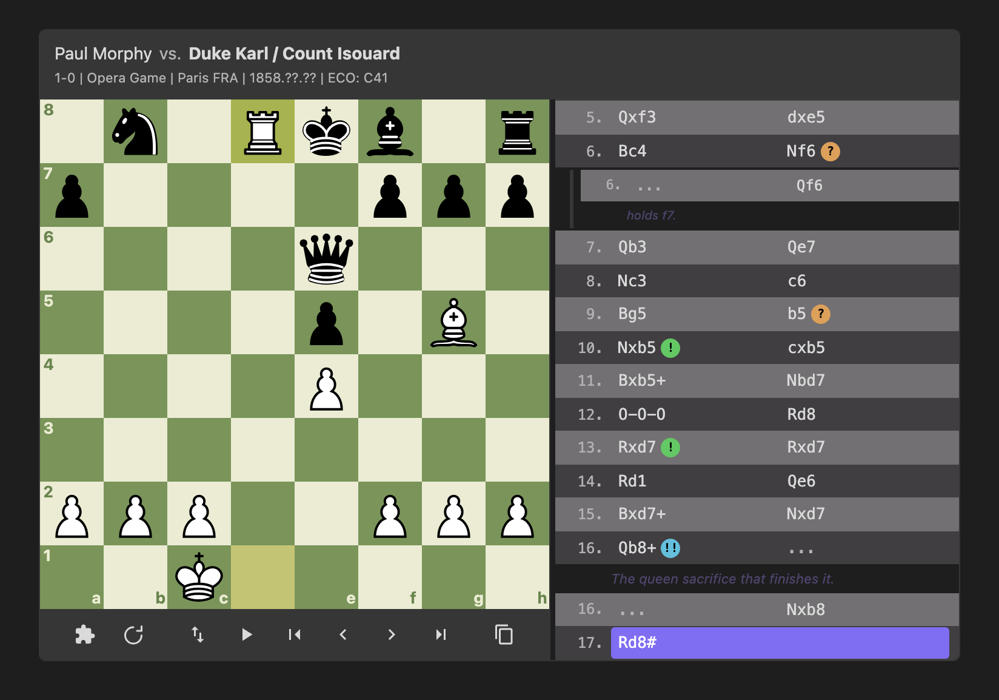

## Quick start

Create a `chessboard` code block and say what it holds with `type:fen` or `type:pgn`.

A position:

````markdown
```chessboard type:fen
rnbqkbnr/pppppppp/8/8/4P3/8/PPPP1PPP/RNBQKBNR b KQkq - 0 1
```
````

A game:

````markdown
```chessboard type:pgn
[Event "My Game"]
[White "Player 1"]
[Black "Player 2"]

1.e4 e5 {The most popular reply.} 2.Nf3 Nc6 {Defending the pawn.} *
```
````

Or copy a FEN or PGN and run **Paste a chess position or game as a board** from the command palette: it inserts a new block with the right `type:` at the cursor.

## Features

### Games with comments, variations and annotations

Paste a PGN and get a board with a header (players, event, site, date, ECO, result) and a move list. `{comments}` show inline, dimmed until you reach that move, and `**bold**` inside a comment is shown bold. Variations in `( ... )` show under the move they branch from. Annotation symbols (`!`, `?`, `!?`, `$1`, `+-` and the Unicode forms) are shown as symbols; hover one to see what it means.

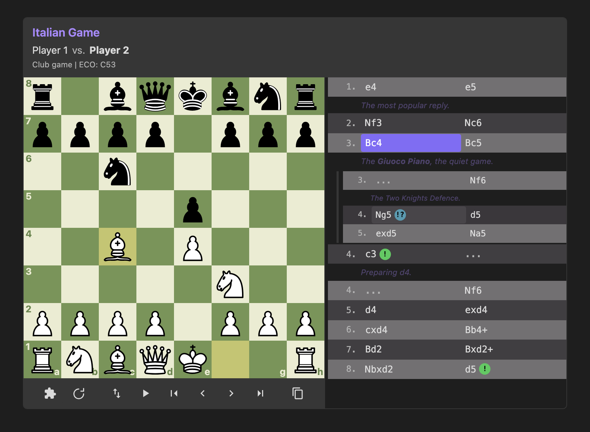

````markdown
```chessboard type:pgn title:"Italian Game" start_at:4
[White "Player 1"]
[Black "Player 2"]
[ECO "C53"]

1.e4 e5 {The most popular reply.} 2.Nf3 Nc6 3.Bc4 Bc5 {The **Giuoco Piano**, the quiet game.}
(3...Nf6 {The Two Knights Defence.} 4.Ng5 $5 d5 5.exd5 Na5)
4.c3 $1 {Preparing d4.} Nf6 5.d4 exd4 6.cxd4 Bb4+ 7.Bd2 Bxd2+ 8.Nbxd2 d5! $14 *
```
````

A `[FEN "..."]` tag starts the game from that position instead of the opening position.

### Eval bar and clocks

Games exported from game sites carry `[%eval 0.35]` / `[%eval #3]` and `[%clk 0:03:00]` in their comments. These are taken out of the comment text: an eval bar beside the board shows the evaluation after each move (mate scores fill the bar for the side that mates), and each side's clock shows above and below the board as you step through. Both are hidden when the PGN has none. Nothing is computed: only what the PGN already contains is shown.

````markdown
```chessboard type:pgn
1. e4 { [%eval 0.2] [%clk 0:03:00] } 1... e5 { [%eval 0.3] [%clk 0:02:59] }
2. Nf3 { [%eval 0.25] [%clk 0:02:55] } 2... Nc6 { [%eval 0.3] [%clk 0:02:50] } *
```
````

### Positions from FEN

One FEN line shows one position. A board-only FEN, as printed in books (`r1bqkb1r/pppp1Qpp/2n2n2/4p3/2B1P3/8/PPPP1PPP/RNB1K1NR`), works too.

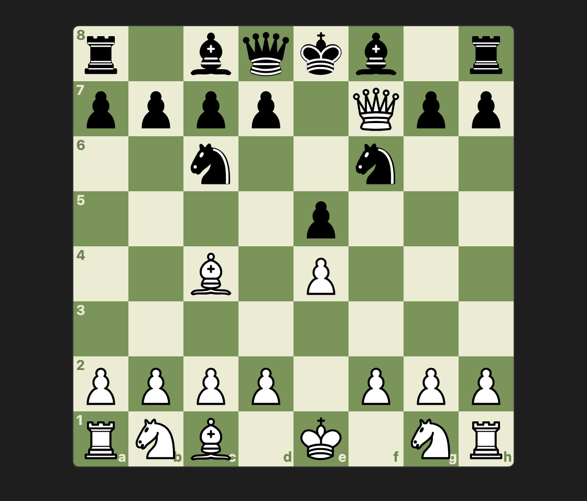

````markdown
```chessboard type:fen
r1bqkb1r/pppp1Qpp/2n2n2/4p3/2B1P3/8/PPPP1PPP/RNB1K1NR b KQkq - 0 4
```
````

### Arrows and squares on a FEN diagram

`arrows:` and `squares:` draw on a FEN board, for book-style diagrams without a PGN. They use the same colours as `[%cal]` and `[%csl]` in PGN comments: put `G` (green, the default), `R` (red), `Y` (yellow) or `B` (blue) in front of an entry, or the colour name after a colon (`f7:red`). Separate entries with commas. Entries that do not parse are skipped, and the developer console names them. In a FEN sequence the drawings stay for every position.

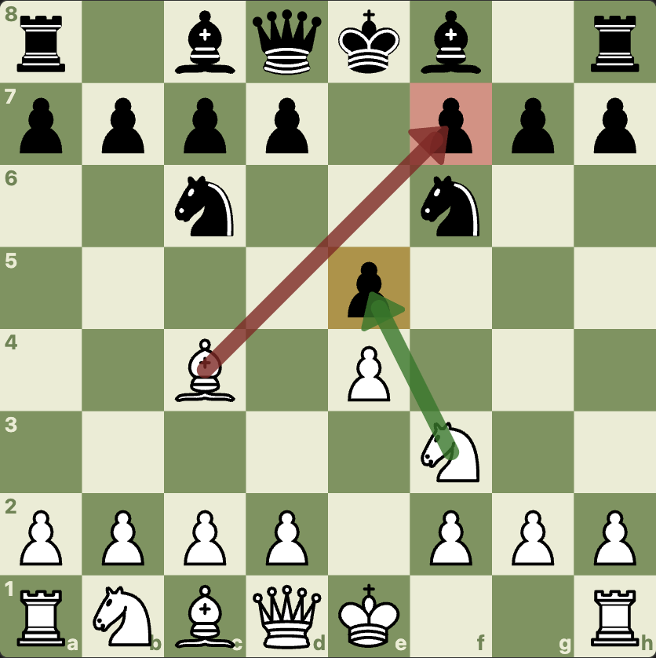

````markdown
```chessboard type:fen arrows:"Rc4f7,Gf3e5" squares:"Rf7,Ye5"
r1bqkb1r/pppp1ppp/2n2n2/4p3/2B1P3/5N2/PPPP1PPP/RNBQK2R w KQkq - 4 4
```
````

### FEN sequences

Several FEN lines in one block become a sequence you step through like a game, one position per line.

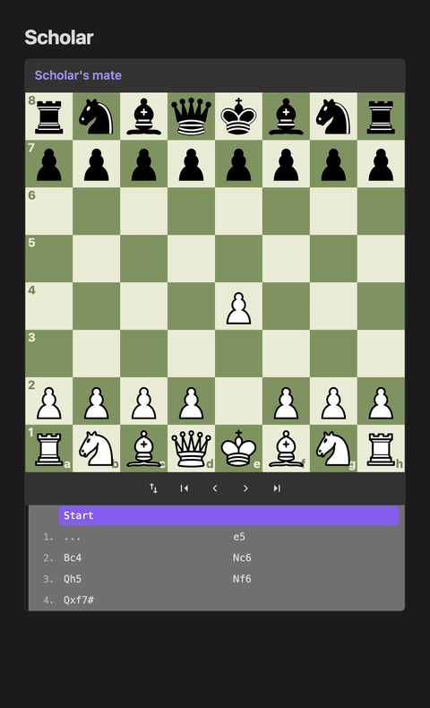

````markdown
```chessboard type:fen title:"Scholar's mate"
rnbqkbnr/pppppppp/8/8/4P3/8/PPPP1PPP/RNBQKBNR b KQkq - 0 1
rnbqkbnr/pppp1ppp/8/4p3/4P3/8/PPPP1PPP/RNBQKBNR w KQkq - 0 2
r1bqkb1r/pppp1Qpp/2n2n2/4p3/2B1P3/8/PPPP1PPP/RNB1K1NR b KQkq - 0 4
```
````

### Trying your own moves

On a game or a single FEN position, drag any legal move to try a line of your own from the position on the board. An "Exploring: 12...Nf6 13.d4" bar appears under the board, the game's moves wait until you are done, and Back to game (or Escape) puts the game back where you left it. The Left arrow takes back your last move. Nothing is written to the note. This works in normal mode; puzzle, step and drill mode keep the board to themselves. While you explore, the game's comment, eval bar and clocks are hidden, since they describe the game's position, not yours. A pawn that reaches the last rank always becomes a queen.

To keep a board from being dragged, add `explore:false`: a FEN diagram then stays as written and takes no focus, and a game keeps its controls but ignores drags in normal mode. `interactive:false` turns it off too, along with the controls.

### Static diagrams for printing

`interactive:false` (or `diagram:true`) draws a plain board with no controls and no move list, so a PDF export or printout looks like a book diagram. A PGN shows the position at `start_at`, with any `[%cal]`/`[%csl]` drawings on that move; a FEN sequence shows its `start_at` line. `flipped:true`, `pieces:`, `board:`, `size:` and `center:` still apply, as do `arrows:` and `squares:` on a FEN block, and `title:"..."` becomes a caption under the board. Screen readers hear the title (or "Chess diagram"), the side to move and the FEN.

A static diagram has no modes: `mode:` and `color:` are ignored, so `mode:puzzle interactive:false` is a plain board. It also leaves out the last-move highlight, NAGs, comments, the eval bar and clocks, and the header.

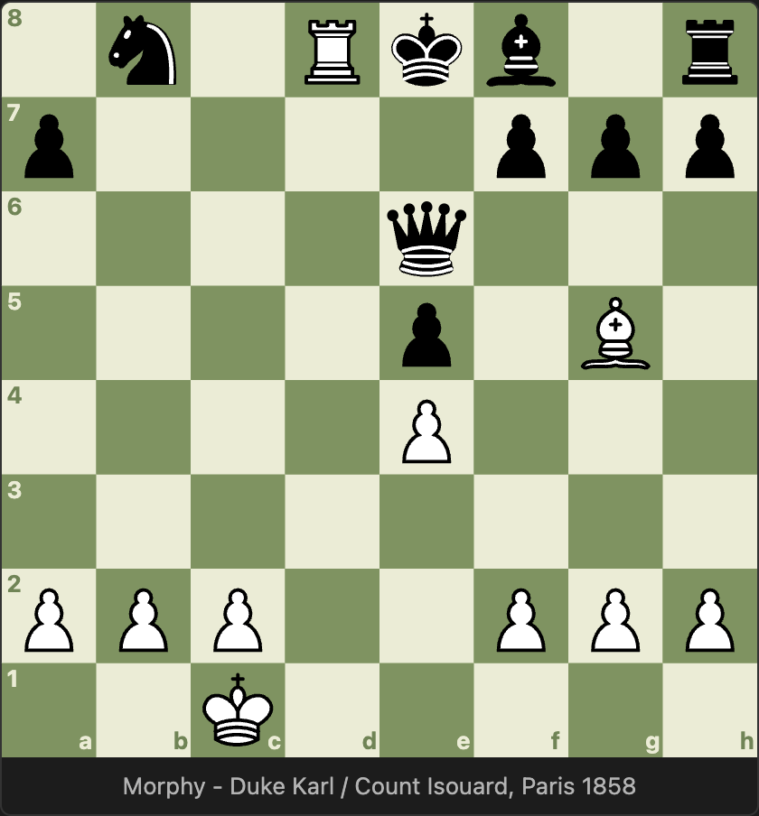

````markdown
```chessboard type:pgn interactive:false start_at:end title:"Morphy - Duke Karl / Count Isouard, Paris 1858"
1.e4 e5 2.Nf3 d6 3.d4 Bg4 4.dxe5 Bxf3 5.Qxf3 dxe5 6.Bc4 Nf6 7.Qb3 Qe7 8.Nc3 c6 9.Bg5 b5 10.Nxb5 cxb5 11.Bxb5+ Nbd7 12.O-O-O Rd8 13.Rxd7 Rxd7 14.Rd1 Qe6 15.Bxd7+ Nxd7 16.Qb8+ Nxb8 17.Rd8# 1-0
```
````

### Puzzle mode

Puzzle mode hides the moves. Play the next move on the board; picking up a piece puts a dot on each square it can move to (a ring on a piece it can take). A right move is played and the reply is made for you, a wrong one is undone. Each press of Hint shows a little more: the comment on the move to find (when it has one), then the piece to move, then the move as an arrow. With `flipped:true` the board is shown from Black's side and you play Black's moves.

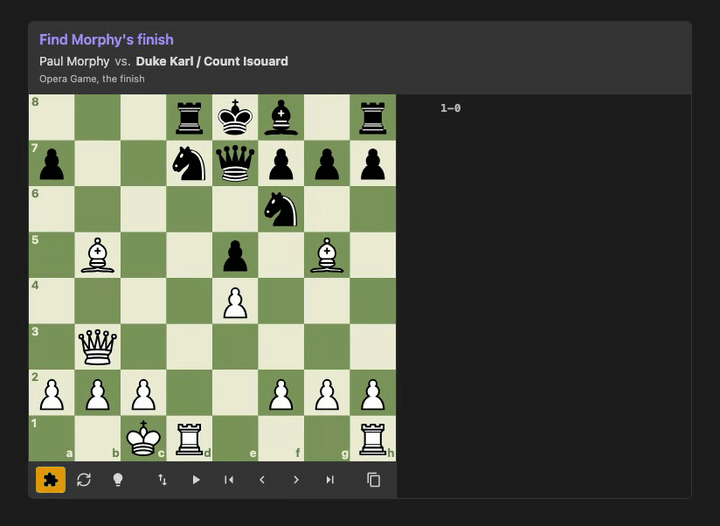

````markdown
```chessboard type:pgn mode:puzzle title:"Find Morphy's finish"
[White "Paul Morphy"]
[Black "Duke Karl / Count Isouard"]
[FEN "3rkb1r/p2nqppp/5n2/1B2p1B1/4P3/1Q6/PPP2PPP/2KR3R w k - 3 13"]
[SetUp "1"]

13.Rxd7 Rxd7 14.Rd1 Qe6 15.Bxd7+ Nxd7 16.Qb8+ Nxb8 17.Rd8# 1-0
```
````

You can also switch any board into puzzle mode with the puzzle button under it.

### Reviewing every puzzle in the vault

The command **Review puzzles from the vault** gathers every `mode:puzzle` block from your notes (a `src:` block reads its file), shuffles them and serves them one at a time in a window: "Puzzle 3 of 12", the board in puzzle mode with Hint and reset, and a link to the note the puzzle is in. Skip moves on; once a puzzle is solved the button reads Next. After the last one you can shuffle again. Your notes are the deck: nothing is written back to them.

### Drill mode

Drill mode is for practising an opening. With `mode:drill color:white` (or `color:black`) you play your side and the board plays the other, picking its replies from the main line and the variations, so each run can go down a different line. A move the PGN does not have is shown as a red arrow and undone. Where the PGN gives more than one move for your side, any of them is accepted and the line the run follows is shown under the board. Hint works as in puzzle mode, the reset button starts a new run, and when the line runs out you get the same report as a puzzle, with the moves list shown again. Nothing is written back to the note.

````markdown
```chessboard type:pgn mode:drill color:white title:"Italian or Ruy Lopez"
1.e4 e5 2.Nf3 Nc6 3.Bc4 (3.Bb5 a6 4.Ba4) Bc5 (3...Nf6 4.Ng5) 4.c3 *
```
````

### Step mode and the keyboard

Step mode hides the moves you have not reached yet, so the game unfolds as you step forward, comments included. Turn it on with `mode:step` or the step button.

With the board focused: Left and Right arrows step through moves, Home and End jump to the start and end, and F flips the board.

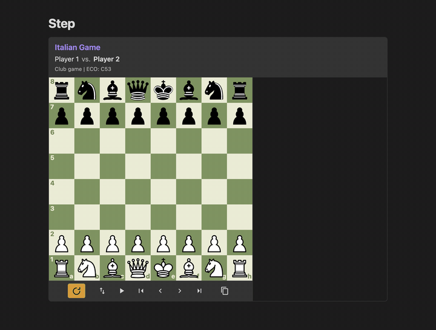

````markdown
```chessboard type:pgn mode:step title:"Italian Game"
1.e4 e5 2.Nf3 Nc6 3.Bc4 Bc5 4.c3 Nf6 5.d4 exd4 *
```
````

### Auto-play

The play button plays the game through at the speed set in the settings. Press it again to pause.

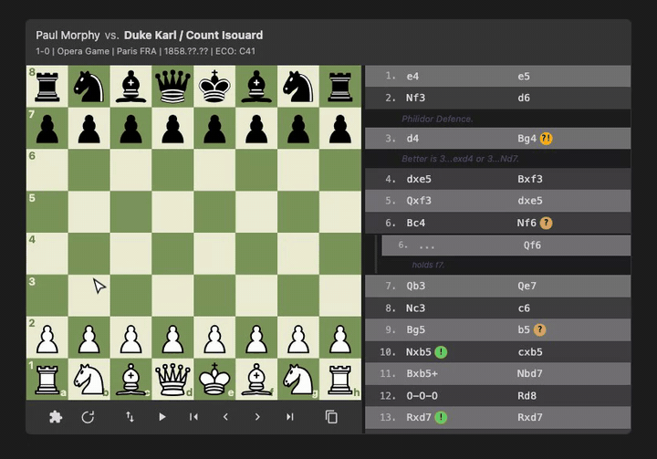

````markdown
```chessboard type:pgn start_at:start
[White "Paul Morphy"]
[Black "Duke Karl / Count Isouard"]

1.e4 e5 2.Nf3 d6 3.d4 Bg4 4.dxe5 Bxf3 5.Qxf3 dxe5 6.Bc4 Nf6 7.Qb3 Qe7 ...
```
````

### Games in their own files

`src:` reads a `.pgn` or `.fen` file from your vault, and the board updates when the file changes. `.pgn` and `.fen` files also open in Obsidian's editor, so you can keep a game in its own file, edit it on one side and watch the board follow on the other.

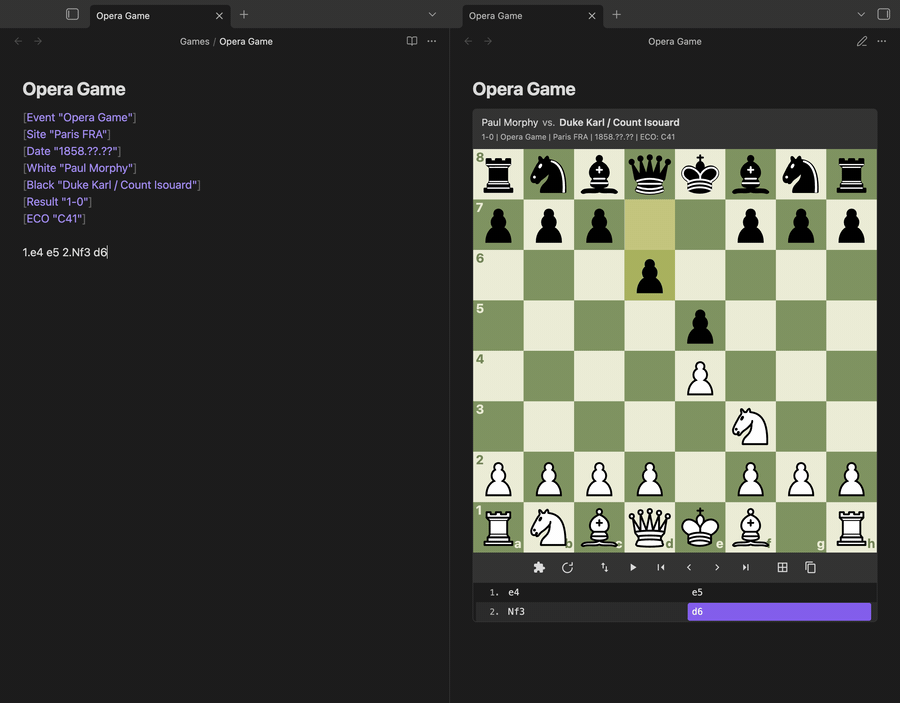

````markdown
```chessboard type:pgn start_at:end src:"Games/Opera Game.pgn"
```
````

A PGN that holds several games, like an export from a game site, gets a game picker above the board: previous/next buttons and "Game 2 of 14 - White vs Black". `game:N` opens game N (counted from 1), and `game:"White vs Black"` opens the game between those players.

````markdown
```chessboard type:pgn src:"Games/Club night.pgn" game:3
```
````

### chess, pgn and fen blocks

Notes written for other tools can work without edits: `pgn`, `fen` and `chess` code blocks can render too. These are off by default; turn each one on under Code blocks in the plugin's settings (Render chess blocks, Render pgn blocks, Render fen blocks), then reload Obsidian. A `pgn` block is a `chessboard type:pgn` block and a `fen` block is a `chessboard type:fen` block. A `chess` block holds either: text with `[Tags]` or move numbers is a PGN, anything else a FEN. All the options work on these blocks as well.

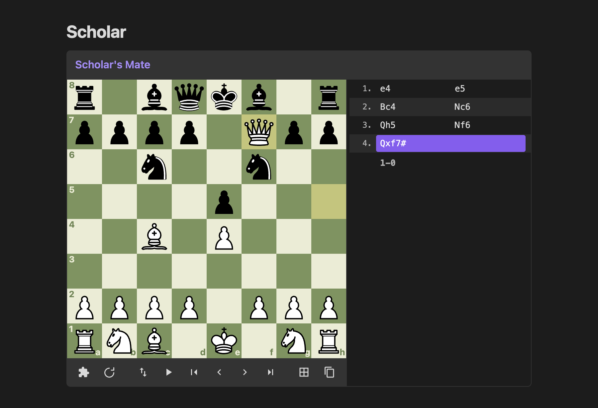

````markdown
```pgn title:"Scholar's Mate"
1.e4 e5 2.Bc4 Nc6 3.Qh5 Nf6 4.Qxf7# 1-0
```
````

Only one plugin can render a code block name: when another plugin also renders `pgn`, `fen` or `chess` blocks, whichever loads first keeps them and the other skips that name. Leave a name off when something else in your vault already renders it. Obsidian reads code block names when it loads, so reload it after changing one.

### Eight piece sets and figurine notation

Pick a default piece set in the settings, or set one per block with `pieces:name`: `standard` (default), `celtic`, `fantasy`, `firi`, `kiwen-suwi`, `rhosgfx`, `shapes`, `spatial`.

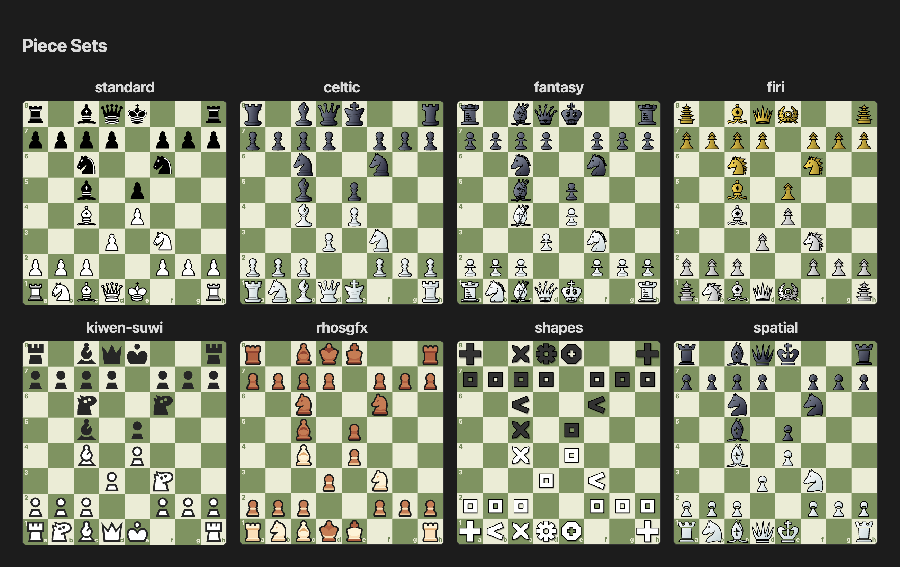

`notation:fan` shows the move list with piece icons from the same set instead of letters.

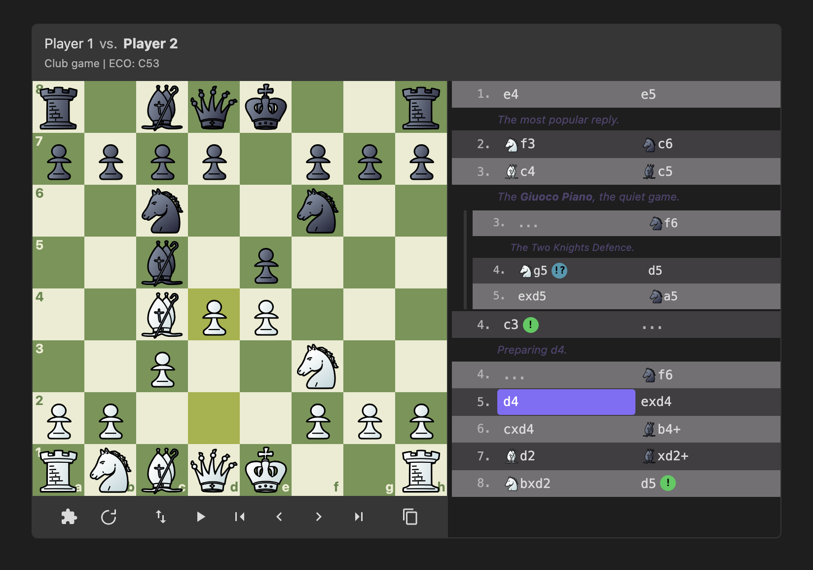

````markdown
```chessboard type:pgn notation:fan pieces:fantasy
1.e4 e5 2.Nf3 Nc6 3.Bc4 Bc5 *
```
````

### Board colours

Pick a default board theme in the settings, or set one per block with `board:name`: `green` (default), `brown`, `blue`, `wood`, `grey` (`gray` works too).

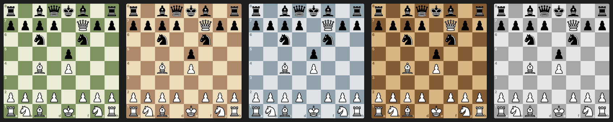

````markdown
```chessboard type:fen board:brown
r1bqkb1r/pppp1Qpp/2n2n2/4p3/2B1P3/8/PPPP1PPP/RNB1K1NR b KQkq - 0 4
```
````

### Light and dark themes

Boards follow Obsidian's theme.

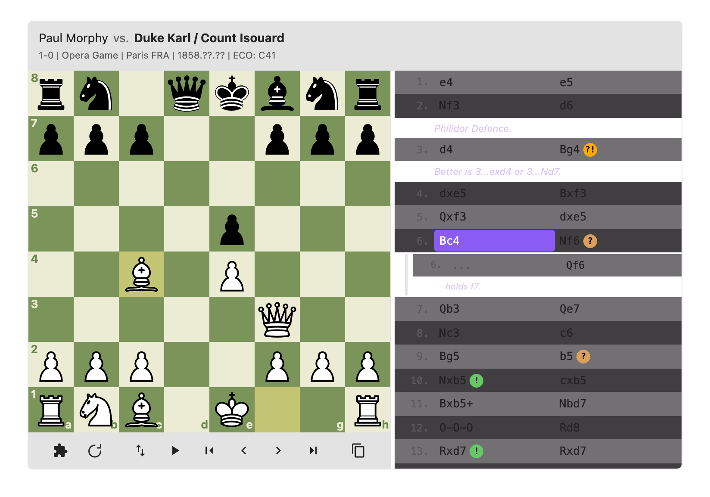

### Sound and screen readers

All three are off by default and turned on in the settings.

- **Move sounds** play a short tone for each move and a lower one for captures, at the volume you set. The tones are made on the fly, with no audio files and no network.
- **Announce moves** has screen readers read out each move as you step through a game, for example "12. Nf3, knight to f3" or "5... exd4, pawn takes d4", including castling, promotion, check and mate.
- **Square labels** has every board label its squares for screen readers with what stands on them, for example "e4, white knight" or "a3, empty".

### Settings

The settings tab has a How to use page, a quick reference for blocks, header tags, options, and sound and accessibility. It also has:

- **Board size**: the default board width, small, medium or large. Override it per block with `size:`.
- **Auto-play speed**: time between moves during auto-play.
- **Board theme**: the default board colours. Override it per block with `board:name`.
- **Piece set**: the default set for boards and figurine notation. Override it per block with `pieces:name`.
- **Move sounds** and **Sound volume**: a tone for each move and capture (off by default).
- **Announce moves**: read each move out to screen readers (off by default).
- **Square labels**: label each square for screen readers with its piece (off by default).
- **Render chess / pgn / fen blocks**: which of the extra code block names render as boards (all off by default). Reload Obsidian after changing one.

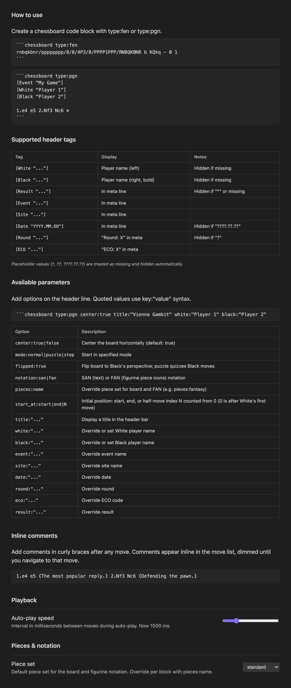
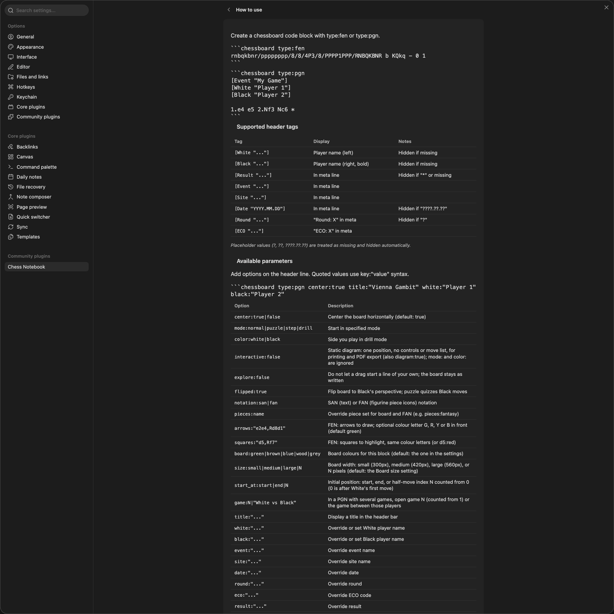

## Options

Add options on the fence line. Quoted values use `key:"value"`.

````markdown
```chessboard type:pgn title:"Vienna Gambit" mode:puzzle flipped:true
````

| Option | Description |
| --- | --- |
| `center:true\|false` | Center the board horizontally (default: true) |
| `mode:normal\|puzzle\|step\|drill` | Start in the given mode |
| `color:white\|black` | The side you play in drill mode (default: White, or Black with `flipped:true`) |
| `interactive:false` | Static diagram: one position, no controls or move list (also `diagram:true`); `mode:` and `color:` are ignored |
| `explore:false` | Dragging a piece does not start a line of your own |
| `flipped:true` | Show the board from Black's side; puzzle mode then quizzes Black's moves |
| `notation:san\|fan` | Text moves (SAN) or figurine piece icons (FAN) |
| `pieces:name` | Piece set for this block |
| `arrows:"e2e4,Rd8d1"` | FEN blocks: arrows to draw (see below) |
| `squares:"d5,Rf7"` | FEN blocks: squares to highlight (see below) |
| `board:green\|brown\|blue\|wood\|grey` | Board colours for this block (default: the one in the settings) |
| `size:small\|medium\|large\|N` | Board width: `small` (300px), `medium` (420px), `large` (560px), or `N` pixels, e.g. `size:360` (default: the Board size setting) |
| `start_at:start\|end\|N` | Initial position: the start, the end, or index N (see below) |
| `src:path` | Read the FEN or PGN from a file in the vault, e.g. `src:"Games/Opera Game.pgn"` |
| `game:N`, `game:"White vs Black"` | In a PGN with several games, open game N (counted from 1) or the game between those players |
| `title:"..."` | Title in the header bar |
| `white:"..."`, `black:"..."` | Set or override the player names |
| `event:"..."`, `site:"..."`, `date:"..."`, `round:"..."`, `eco:"..."`, `result:"..."` | Set or override the game details |

`start_at:N` counts from zero. In a PGN it counts half-moves (single moves by either side): `start_at:0` shows the position after White's first move, `start_at:1` after Black's reply, and `start_at:4` after White's third move. In a FEN sequence, `start_at:0` is the first FEN line, `start_at:1` the second, and so on. For a game from the starting position, N is 2M-2 to open after White's move M and 2M-1 after Black's move M (after 6...Nf6 is `start_at:11`). A number past the end shows the last position.

Header tags White, Black, Result, Event, Site, Date, Round and ECO show in the header. Placeholder values (`?`, `??`, `????.??.??`) are hidden.

## Controls

Under the board: puzzle mode, step mode, hint, reset, flip, auto-play, first/previous/next/last move, copy FEN (the position on the board) and copy PGN. FEN sequences have copy FEN too.

## Installation

From Community plugins in Obsidian's settings, once it is listed. Until then, copy `main.js`, `manifest.json` and `styles.css` from the latest release into `.obsidian/plugins/chess-notebook/` in your vault and enable the plugin.

## Development

```sh
npm ci
npm test
npm run build
```

To try a change in Obsidian, copy `main.js`, `manifest.json` and `styles.css` into `<your vault>/.obsidian/plugins/chess-notebook/` and reload the plugin.

The images and GIFs in `docs/media/` are captured in the real Obsidian app with the maintainer's own capture tool, which is not part of this repo. To change one, open an issue or attach your own screenshot to the pull request.

## License

MIT, see [LICENSE](LICENSE). The bundled libraries and piece sets keep their own licenses; see [NOTICE](NOTICE).
